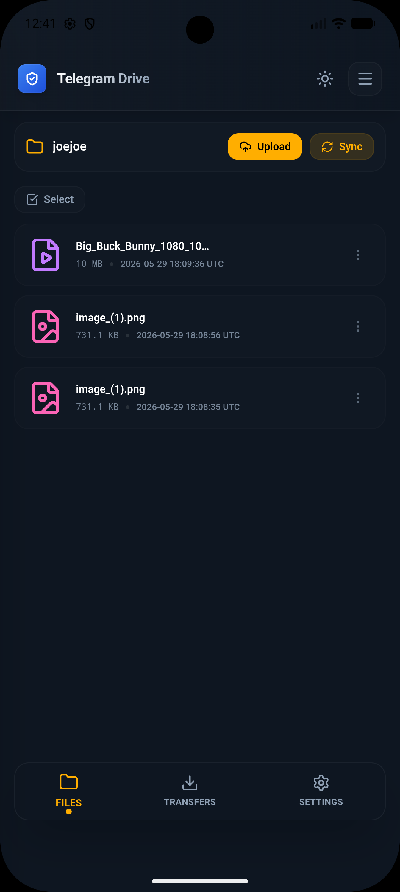
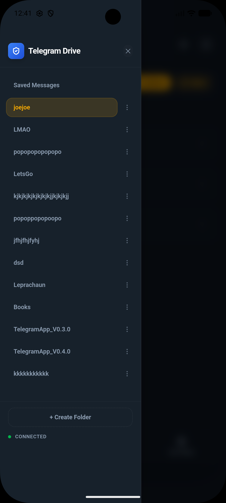
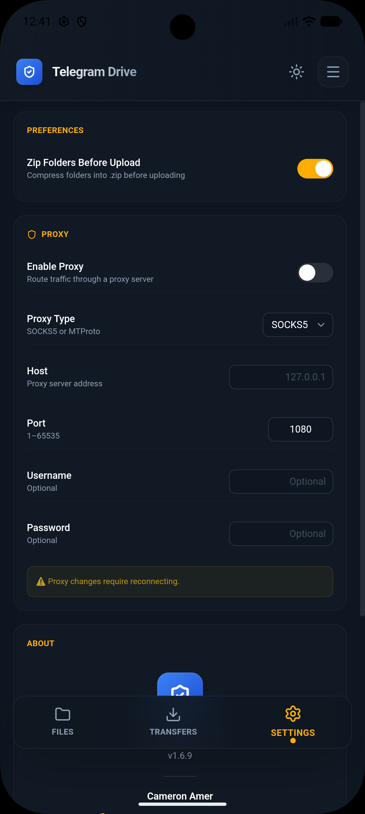

# Telegram Drive — Android Edition

<div align="center">


**Turn your Telegram account into unlimited, secure cloud storage — now on Android.**

[](LICENSE)
[](https://www.android.com/)
[](https://tauri.app/)
[](https://github.com/caamer20/Telegram-Drive)

</div>

---

> ⚠️ **Important Disclosure**
>
> This project is an **Android adaptation** of the original [Telegram Drive](https://github.com/caamer20/Telegram-Drive) by [Cameron Amer (caamer20)](https://github.com/caamer20).
>
> The original concept — using Telegram as a cloud storage backend — and the entire application architecture, Rust backend, and React frontend belong entirely to the original developer.
>
> **Our contribution** was porting and engineering a native Android build so that the same application concept could run on mobile devices. We are deeply grateful to the original developer for open-sourcing this project.
>
> This project is **not affiliated with Telegram**.

---

## Table of Contents

- [Overview](#overview)
- [Motivation](#motivation)
- [Features](#features)
- [Architecture Overview](#architecture-overview)
- [Screenshots](#screenshots)
- [Installation](#installation)
- [Build Instructions](#build-instructions)
- [Usage Guide](#usage-guide)
- [Technologies Used](#technologies-used)
- [Future Roadmap](#future-roadmap)
- [Known Limitations](#known-limitations)
- [Credits](#credits)
- [License](#license)

---

## Overview

**Telegram Drive — Android Edition** allows you to use your Telegram account as a personal, unlimited cloud storage drive — directly from your Android phone.

Files are stored as messages in your Telegram Saved Messages, organized into folders. You can upload, download, preview, share, and manage files of any type, all encrypted in transit via Telegram's MTProto protocol.

This is a port of the original [Telegram Drive](https://github.com/caamer20/Telegram-Drive) desktop application to Android, built using the same Tauri + Rust + React stack.

---

## Motivation

The original Telegram Drive project supported **Windows, macOS, and Linux** but did not include an Android application.

We — [Aamir](https://github.com/usmaniaamir41-dotcom) and [Arish](https://github.com/worriedwolf629-sudo) — noticed this gap and decided to engineer an Android port so that mobile users could benefit from the same concept. This project was a learning opportunity for both of us in Android development, Tauri mobile builds, Rust cross-compilation, and Telegram's MTProto API.

We want to be fully transparent: **the original idea is not ours.** All credit for the core concept goes to [Cameron Amer](https://github.com/caamer20).

---

## Features

### 📁 File Management
- Upload any file type (photos, videos, documents, audio, archives)
- Organize files into named folders
- Move, rename, and delete files
- Bulk operations (select multiple, bulk download, bulk delete)

### 📱 Mobile-First Android UI
- Native mobile dashboard with touch-friendly interface
- Bottom navigation bar
- Pull-to-refresh and swipe gestures
- Status bar aware layout (no overlap)
- Dark mode support with multiple themes

### 🔒 Security & Privacy
- All data stored in your personal Telegram account
- End-to-end encrypted via Telegram MTProto
- No third-party servers — your data never leaves Telegram
- Session-based authentication (no password stored)

### 📤 Upload & Download
- Background file uploads with progress tracking
- Queue system for multiple simultaneous uploads/downloads
- Resume interrupted transfers
- Upload from Gallery, Files, or share from other apps

### 👁️ File Preview
- In-app image preview with zoom
- Video and audio playback
- PDF viewer
- Archive (ZIP/7z) browser

### ⚙️ Settings & Customization
- Multi-language support (17+ languages)
- Custom themes
- VPN/Proxy support
- Bandwidth throttling
- Performance mode

---

## Architecture Overview

```
┌─────────────────────────────────────────────────┐
│                Android Application               │
│                                                  │
│   ┌─────────────────────────────────────────┐   │
│   │         React Frontend (TypeScript)      │   │
│   │                                          │   │
│   │  MobileDashboard ──► TouchFileList       │   │
│   │  BottomNavBar    ──► ActionPopover       │   │
│   │  AuthWizard      ──► Settings            │   │
│   └────────────────────┬────────────────────┘   │
│                        │  Tauri IPC              │
│   ┌────────────────────▼────────────────────┐   │
│   │           Rust Backend (Tauri)           │   │
│   │                                          │   │
│   │  grammers-client ──► Telegram MTProto   │   │
│   │  File chunking   ──► Storage engine     │   │
│   │  Session mgmt    ──► Auth flow          │   │
│   └─────────────────────────────────────────┘   │
└─────────────────────────────────────────────────┘
                         │
                         ▼
              ┌──────────────────┐
              │  Telegram Servers │
              │  (Saved Messages) │
              └──────────────────┘
```

- **Frontend:** React + TypeScript, Tailwind CSS, Framer Motion
- **Backend:** Rust, Tauri v2, grammers (Telegram MTProto client)
- **Build:** Tauri Android, Gradle, NDK (aarch64-linux-android)
- **Communication:** Tauri IPC commands between frontend and Rust

---

## Screenshots

| Splash Screen | Auth Screen | Mobile Dashboard |
|:---:|:---:|:---:|
|  |  |  |

| Folder List | Settings | Transfer Queue |
|:---:|:---:|:---:|
|  |  |  |

| Image Preview | Video Playback | Audio Playback |
|:---:|:---:|:---:|
|  |  |  |

---

## Installation

### Download APK (Recommended)

1. Go to the [**Releases**](../../releases) page
2. Download the latest `TelegramDrive-Android-v*.apk`
3. On your Android device, enable **"Install from unknown sources"**:
   - Android 8+: Settings → Apps → Special access → Install unknown apps
4. Open the APK file and install

### Requirements
- Android 7.0 (API 24) or higher
- A Telegram account
- Telegram API credentials (free — see below)

### Getting Telegram API Credentials

1. Visit [my.telegram.org](https://my.telegram.org)
2. Log in with your Telegram phone number
3. Click **"API development tools"**
4. Create a new application (any name/platform)
5. Copy your **`api_id`** and **`api_hash`**
6. Enter these in the app's login screen

> Your API credentials are stored locally only and never sent anywhere except Telegram's servers.

---

## Build Instructions

### Prerequisites

- [Node.js](https://nodejs.org/) 18+
- [Rust](https://rustup.rs/) (stable)
- [Android Studio](https://developer.android.com/studio) with NDK
- Java 17 (e.g., [Adoptium](https://adoptium.net/))
- Android SDK (API 24+)
- Tauri CLI v2: `cargo install tauri-cli`

### Add Android Target

```bash
rustup target add aarch64-linux-android
```

### Clone and Install

```bash
git clone https://github.com/usmaniaamir41-dotcom/Telegram-Drive-Android
cd Telegram-Drive-Android/app
npm install
```

### Build Android APK

```bash
# Full build (requires connected device or emulator for signing)
npm run build:android

# Or build via Gradle directly (if Rust .so already compiled)
cd src-tauri/gen/android
./gradlew assembleDebug -x rustBuildArm64Debug -x rustBuildArmDebug
```

The APK will be at:
```
app/src-tauri/gen/android/app/build/outputs/apk/arm64/debug/app-arm64-debug.apk
```

---

## Usage Guide

1. **Launch** the app and enter your Telegram `api_id` and `api_hash`
2. **Authenticate** using your phone number and the OTP sent by Telegram
3. **Browse** your Saved Messages organized as folders
4. **Upload** files using the upload button or by sharing from another app
5. **Download** files by long-pressing and selecting Download
6. **Organize** with folders — create, rename, delete, and move files between folders
7. **Preview** images, videos, audio, and PDFs inline

---

## Technologies Used

| Technology | Purpose |
|:-----------|:--------|
| [Tauri v2](https://tauri.app/) | Cross-platform app framework |
| [Rust](https://www.rust-lang.org/) | Backend logic and native performance |
| [grammers](https://github.com/Lonami/grammers) | Telegram MTProto client library |
| [React 19](https://react.dev/) | Frontend UI framework |
| [TypeScript](https://www.typescriptlang.org/) | Type-safe frontend code |
| [Tailwind CSS v4](https://tailwindcss.com/) | Styling |
| [Framer Motion](https://www.framer.com/motion/) | Animations |
| [Android NDK](https://developer.android.com/ndk) | Native Rust compilation for Android |
| [Gradle](https://gradle.org/) | Android build system |

---

## Future Roadmap

- [ ] Google Play Store distribution
- [ ] iOS support (Tauri iOS build)
- [ ] Biometric lock (fingerprint/face unlock)
- [ ] Auto-backup from Gallery
- [ ] Widget for quick upload
- [ ] Folder sharing via Telegram invite links
- [ ] Search across all files globally
- [ ] Offline mode with local cache

---

## Known Limitations

- **arm64 only:** The compiled release targets ARM64 (aarch64). Most modern Android phones use arm64 and will work fine.
- **No Play Store:** Install via APK sideload only for now.
- **API credentials required:** You must supply your own Telegram API ID and hash.
- **Telegram limits:** Large files (>2 GB) are subject to Telegram's upload limits.
- **Not affiliated with Telegram:** This is an unofficial third-party app.

---

## Credits

### 🏆 Original Project

> **Telegram Drive** — the concept, architecture, and entire codebase this Android port is based on.
>
> **Author:** [Cameron Amer (caamer20)](https://github.com/caamer20)
> **Repository:** [https://github.com/caamer20/Telegram-Drive](https://github.com/caamer20/Telegram-Drive)
>
> *Thank you for open-sourcing this project and making this Android adaptation possible.*

---

### 🤝 Android Adaptation Contributors

| Contributor | Role | GitHub |
|:------------|:-----|:-------|
| **Aamir** | Android port planning, engineering & implementation | [@usmaniaamir41-dotcom](https://github.com/usmaniaamir41-dotcom) |
| **Arish** | Android port planning, engineering & implementation | [@worriedwolf629-sudo](https://github.com/worriedwolf629-sudo) |

We collaborated on planning, engineering the Tauri Android build pipeline, fixing mobile UI layout issues, adding Android-specific permissions, and publishing this Android adaptation.

---

### 📚 Open-Source Libraries

- [grammers](https://github.com/Lonami/grammers) — Telegram MTProto client in Rust by Lonami
- [Tauri](https://tauri.app/) — the Tauri team
- [Framer Motion](https://www.framer.com/motion/) — Framer
- [Lucide Icons](https://lucide.dev/) — the Lucide contributors

---

## License

This project is licensed under the **MIT License** — see the [LICENSE](LICENSE) file for details.

The MIT License was chosen to match the original Telegram Drive project's license and ensure full compliance with its terms.

---

<div align="center">

*This is an unofficial Android adaptation. Not affiliated with Telegram.*

**Original Project:** [caamer20/Telegram-Drive](https://github.com/caamer20/Telegram-Drive)

</div>
